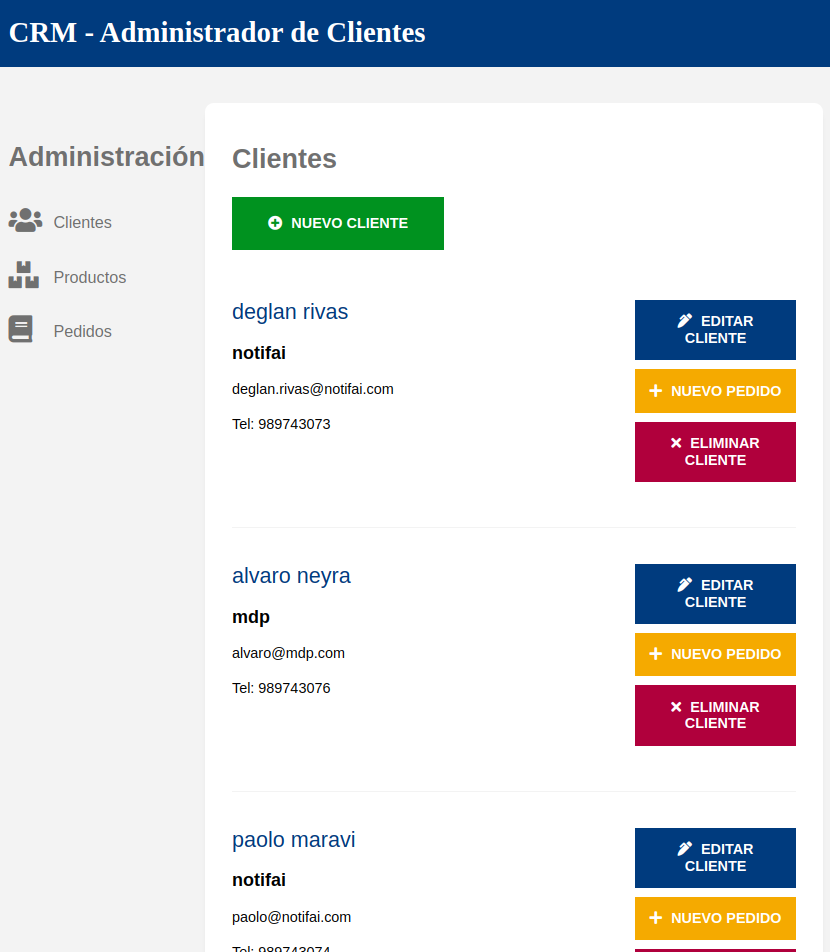

<div align="center">
   
  <h2>Gestor de Pedidos</h2>
  <p>
    CRM para gestionar clientes, productos y pedidos
  </p>
  </img>
</div>


## 🛠️ Stack

- [**React - ReactRouter**](https://react.dev/) - Crear las rutas que consume el usuario final. Desplegado en **Netlify**
- [**Node - Express**](https://expressjs.com/) - Crear los endpoints que consume el frontend. Desplegado en **Railway**
- [**MongoDB**](https://www.mongodb.com/atlas/database) - Persitir la información que consume el backend. Desplegado en **MongoDB Atlas**


## 🚀 Empezar

### **Versión Online**

Usa este [enlace](https://cozy-marshmallow-9bef05.netlify.app/ "Probar Demo") para probar el código desplegado en Netlify.


### **Versión Local**
1. Ejecuta los siguientes comandos para *Linux*. Previamente debes haber instalado *Docker*

```bash
# Crea una nueva carpeta:
mkdir my_demo ; cd my_demo

# Clona este repositorio
git clone https://github.com/deglan-rivas/frontend-node-crud.git ; cd frontend-node-crud/

# Inicializa los contenedores:
docker compose up -d
```

2. Abre [**http://localhost:8080**](http://localhost:8080/) en tu navegador para ver el resultado 🚀

3. Una vez terminada la prueba. Elimina las carpetas
```bash
# Detén los contenedores:
docker compose down

# Elimina la carpeta usada manualmente o usando la terminal:
cd ../../ ; rm -rf my_demo
```